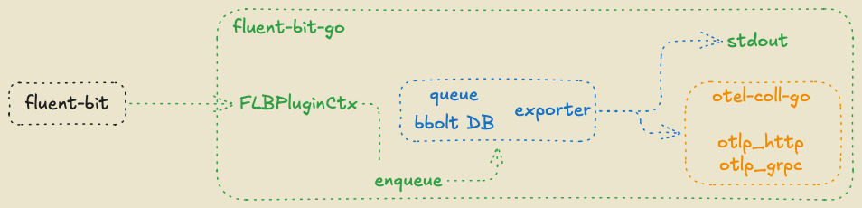

# fluent-bit-output-go

[](https://github.com/nickytd/fluent-bit-output-go/actions/workflows/ci.yml)
[](https://github.com/nickytd/fluent-bit-output-go/actions/workflows/release.yml)
[](go.mod)
[](LICENSE)
[](https://github.com/nickytd/fluent-bit-output-go/releases)

A [Fluent Bit](https://fluentbit.io/) output plugin written in Go, compiled as
a C shared library. It converts log records from Fluent Bit's pipeline into
[OpenTelemetry](https://opentelemetry.io/) [plog.Logs](https://pkg.go.dev/go.opentelemetry.io/collector/pdata/plog#Logs) structures, buffers them
in a persistent [bbolt](https://github.com/etcd-io/bbolt) queue on the local
disk, and forwards them to a configurable OTLP target (gRPC, HTTP, or stdout
for debugging).



The plugin is distributed as a container image published to GHCR and is
intended to run as a Kubernetes initContainer that copies the compiled `.so`
into a shared volume for a co-located `fluent-bit` container to load with `-e`.

## Features

- Handles **standard flat records** — each record becomes a `LogRecord` inside
  a `ResourceLogs` with fields mapped as attributes.
- Handles **OpenTelemetry envelope log groups** — Fluent Bit's grouping
  mechanism that preserves resource and instrumentation-scope metadata across
  records in a batch.
- Maps well-known fields:
  - `body` / `log` / `message` → `LogRecord.Body`
  - `severity_number` → `LogRecord.SeverityNumber`
  - `severity_text` → `LogRecord.SeverityText`
  - `level` → both severity text and severity number (via a level-to-number
    lookup: `debug`/`info`/`warn`/`error`/…)
  - `trace_id` (hex string) → `LogRecord.TraceID`
  - `span_id` (hex string) → `LogRecord.SpanID`
  - everything else → `LogRecord.Attributes`
- **Resource attribute promotion** via `resource_attributes` — a
  comma-separated list of record field names to route to OTLP resource
  attributes instead of log record attributes. Backends such as
  VictoriaLogs automatically promote resource attributes to stream
  fields (indexed), making this key useful for fields like `host.name`,
  `k8s.namespace.name`, `k8s.pod.name`, `k8s.container.name`.
- **Persistent queue** via bbolt B+ tree — records survive plugin/process
  restarts and endpoint outages, then drain in FIFO order when the endpoint
  recovers. Delivery semantics are **at-least-once**: a record enqueued to
  bbolt is only removed after `exp.Export` returns nil, and a crash after
  export but before delete replays the record on the next start.
- **Configurable export target**: stdout (OTLP JSON, for debugging), OTLP/HTTP,
  or OTLP/gRPC.

## Usage

```bash
make run
# or manually:
fluent-bit -e bin/go-out.so -c fluent-bit.yaml
```

The plugin registers as `go-out`. Configure it in your Fluent Bit pipeline:

```yaml
pipeline:
  outputs:
    - name: go-out
      match: "*"
      # queue_dir: /tmp/fluent-bit-bbolt
      # otlp_grpc: localhost:4317
      # otlp_http: http://localhost:4318
      # otlp_http_headers: "Authorization=Bearer token;X-Tenant=acme;VL-Stream-Fields=host.name,severity"
      # resource_attributes: "host.name,k8s.namespace.name,k8s.pod.name,k8s.container.name"
      # timeout: 10s
      # tls_ca_file: /etc/ssl/certs/ca.pem
      # tls_cert_file: /etc/ssl/certs/client.crt
      # tls_key_file: /etc/ssl/private/client.key
```

## Configuration Keys

| Key | Default | Description |
|-----|---------|-------------|
| `id` | auto-increment | Instance identifier used as a log-line prefix, metric label, and the bbolt filename (`<id>.db`). Must match `[A-Za-z0-9._-]+` and be at most 64 characters. |
| `queue_dir` | `/tmp/fluent-bit-bbolt` | Absolute path to the directory holding the per-instance bbolt file (`<id>.db`). Relative paths are rejected. |
| `otlp_grpc` | *(none)* | OTLP gRPC endpoint (e.g. `localhost:4317`) |
| `otlp_http` | *(none)* | OTLP HTTP base URL (e.g. `http://localhost:4318`; `/v1/logs` is appended automatically) |
| `otlp_http_headers` | *(none)* | Semicolon-separated extra HTTP headers for every OTLP/HTTP request (e.g. `Authorization=Bearer token;X-Tenant=acme`). Semicolons are used as delimiter so header values may contain commas (e.g. `VL-Stream-Fields=host.name,severity`). |
| `timeout` | `10s` | Per-request export timeout. Zero means no timeout. |
| `tls_ca_file` | *(none)* | Path to a PEM CA certificate for verifying the remote endpoint. Re-read on every TLS handshake. |
| `tls_cert_file` | *(none)* | Path to a PEM client certificate for mTLS. Requires `tls_key_file`. Re-read on every TLS handshake. |
| `tls_key_file` | *(none)* | Path to a PEM client key for mTLS. Requires `tls_cert_file`. Re-read on every TLS handshake. |
| `tls_insecure_skip_verify` | *(none)* | Skip TLS certificate verification (`true`/`false`). For testing only. |
| `resource_attributes` | *(none)* | Comma-separated record field names to promote to OTLP resource attributes instead of log record attributes (e.g. `host.name,k8s.namespace.name,k8s.pod.name,k8s.container.name`). Resource attributes become stream fields in VictoriaLogs. |

If neither `otlp_grpc` nor `otlp_http` is set, records are emitted as OTLP
JSON on stdout — useful for local debugging. Setting both is rejected at
init time.

## Testing

```bash
make unit-test    # unit tests
make e2e-test     # builds .so, starts otelcol, runs fluent-bit, asserts output
make test         # both
```

E2E tests require `fluent-bit` and `otelcol` on PATH. They start an OTel
Collector with the debug exporter, run Fluent Bit with the plugin exporting
via OTLP/HTTP, and assert that log records (resource attributes, severity,
body) appear in the collector's output.

## How It Works

Each Fluent Bit flush call converts msgpack records to `plog.Logs`, serialises
them with `plog.ProtoMarshaler`, and writes the bytes to a per-instance bbolt
file (`<queue_dir>/<id>.db`) under a monotonically-increasing uint64 key.

A single background goroutine drains the queue in FIFO order, calling
`exp.Export` and deleting each key only after a successful export
(at-least-once semantics). On export failure it enters a capped exponential
backoff (500 ms → 30 s) rather than dropping records. The exporter backend is
one of: stdout JSON (debugging), OTLP/HTTP, or OTLP/gRPC.

## Container image and Kubernetes deployment

The plugin is published as a multi-arch (`linux/amd64` + `linux/arm64`)
container image on GHCR at `ghcr.io/nickytd/fluent-bit-output-go`.

The image is intentionally minimal — it carries `/plugin/go-out.so` (the
compiled shared library) and a small static `copy-plugin` entrypoint. It is
designed to run as a Kubernetes **initContainer** that copies `go-out.so`
onto a shared `emptyDir`, from which the main `fluent-bit` container then
loads it via `-e`.

## Comparison with Fluent Bit's built-in `opentelemetry` output

Fluent Bit ships a native `opentelemetry` output plugin. This plugin fills gaps that matter for production deployments:

| Capability | Built-in `opentelemetry` | This plugin |
|---|---|---|
| **Persistent queue** | No — in-memory retry only, lost on crash | Yes — bbolt on disk, survives restarts |
| **At-least-once delivery** | No | Yes — record deleted only after successful export |
| **Export failure handling** | Drops after retry budget exhausted | Capped exponential backoff (500 ms → 30 s), never drops |
| **Resource attribute promotion** | No | Yes — `resource_attributes` key routes fields to OTLP resource scope |
| **OTel envelope group support** | Native (built-in processor awareness) | Yes — handles `opentelemetry_envelope` sentinel timestamps |
| **Deployment** | Compiled into Fluent Bit | External `.so` loaded via `-e`, shipped as a container initContainer |

**When to prefer this plugin:** you need durable, at-least-once delivery with automatic replay after endpoint downtime or Fluent Bit restarts, or you want fine-grained control over which fields become OTLP resource attributes.

**When the built-in plugin is sufficient:** you can tolerate in-memory retry semantics and your endpoint is reliably reachable.

## License

Apache-2.0 — see [LICENSE](LICENSE) and [LICENSES/](LICENSES/).
